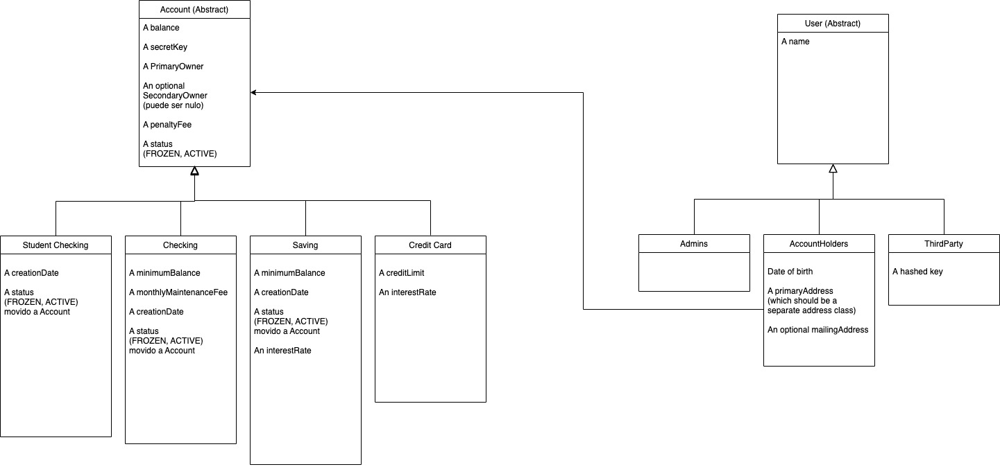

# Final Project Rest Api Bank IH

- Proyecto desarrollado en Java, simulando una API de una entidad bancaria.

## Diagrama de Clases

- Me ha faltado una última revisión y pueden haber habido cambios de última hora

## Funcionamiento de la APP

En Postman y en BBDD todos los métodos funcionan, lanzando las excepciones correctas y respetando las autorizaciones de los accesos a las diferentes rutas.
